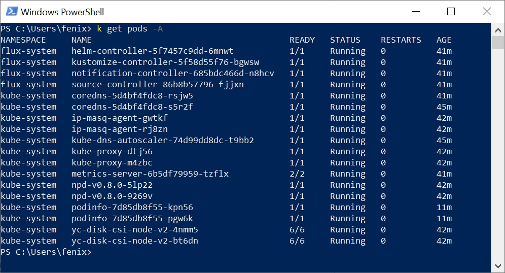
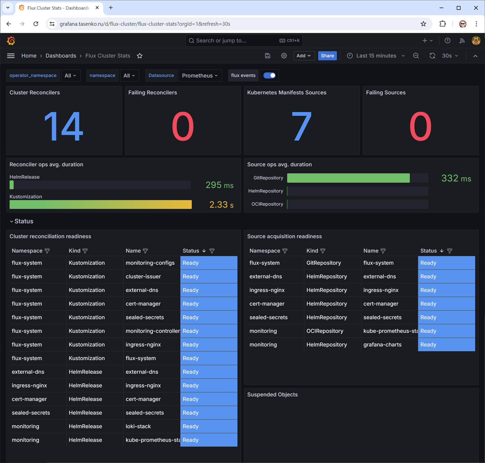
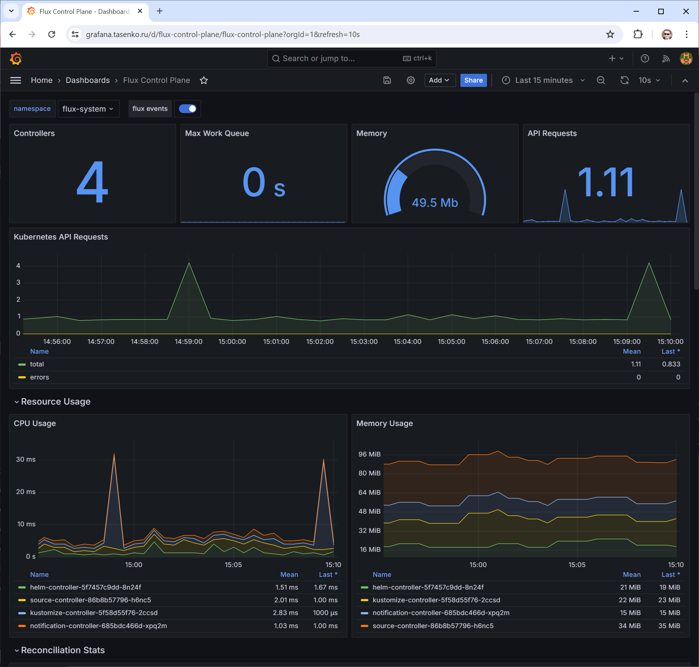
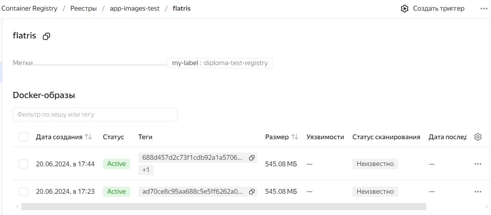
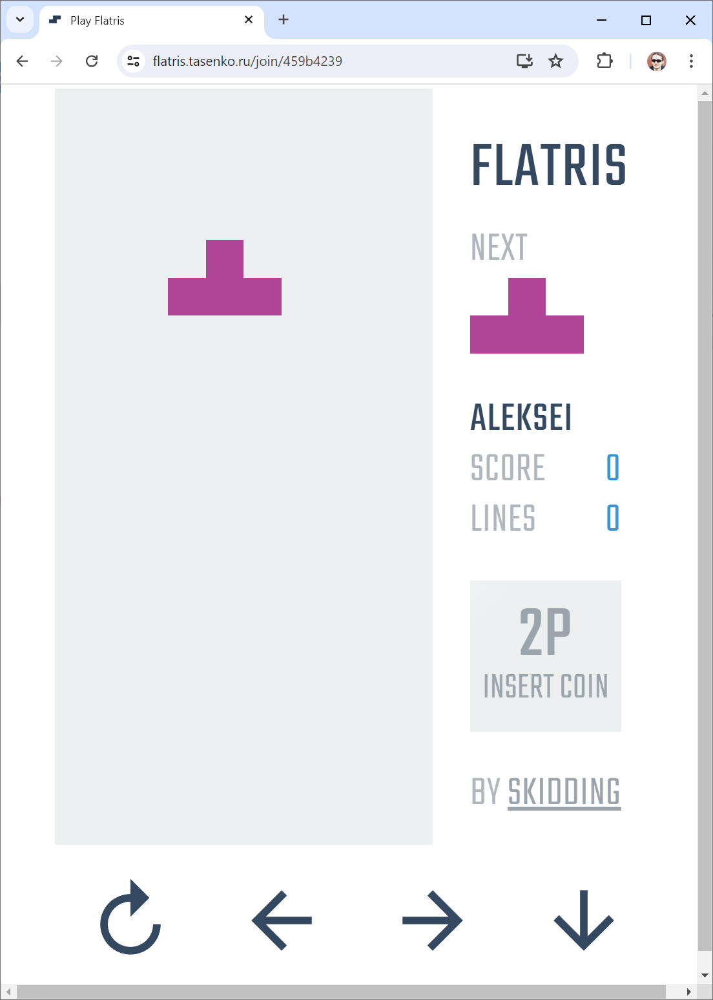
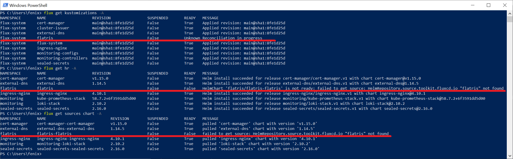
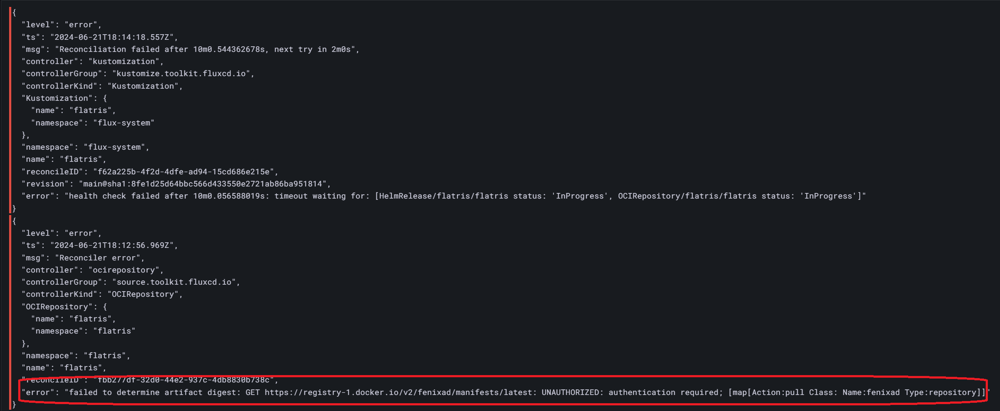
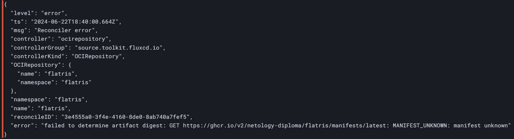
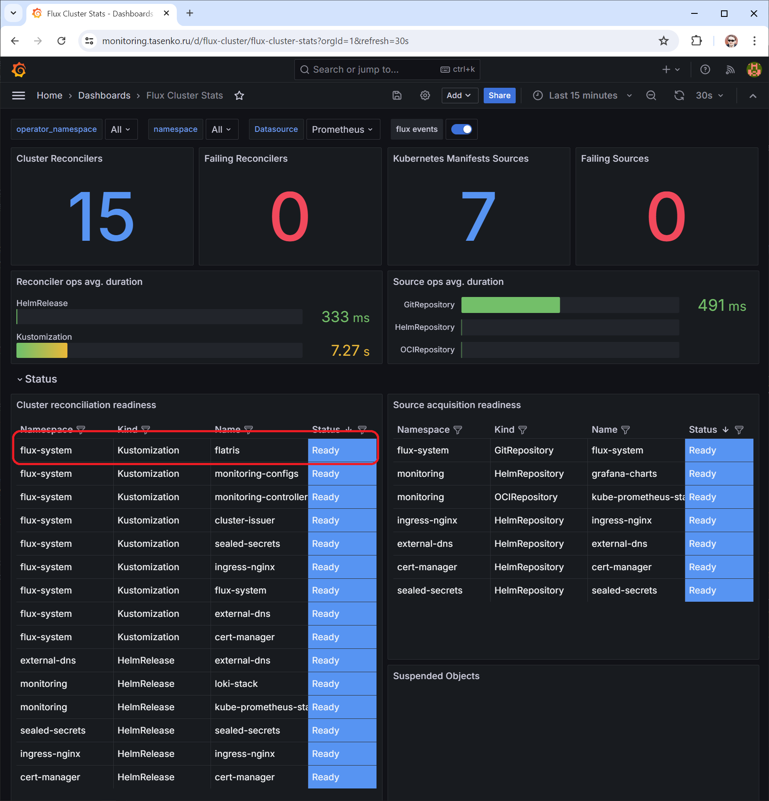
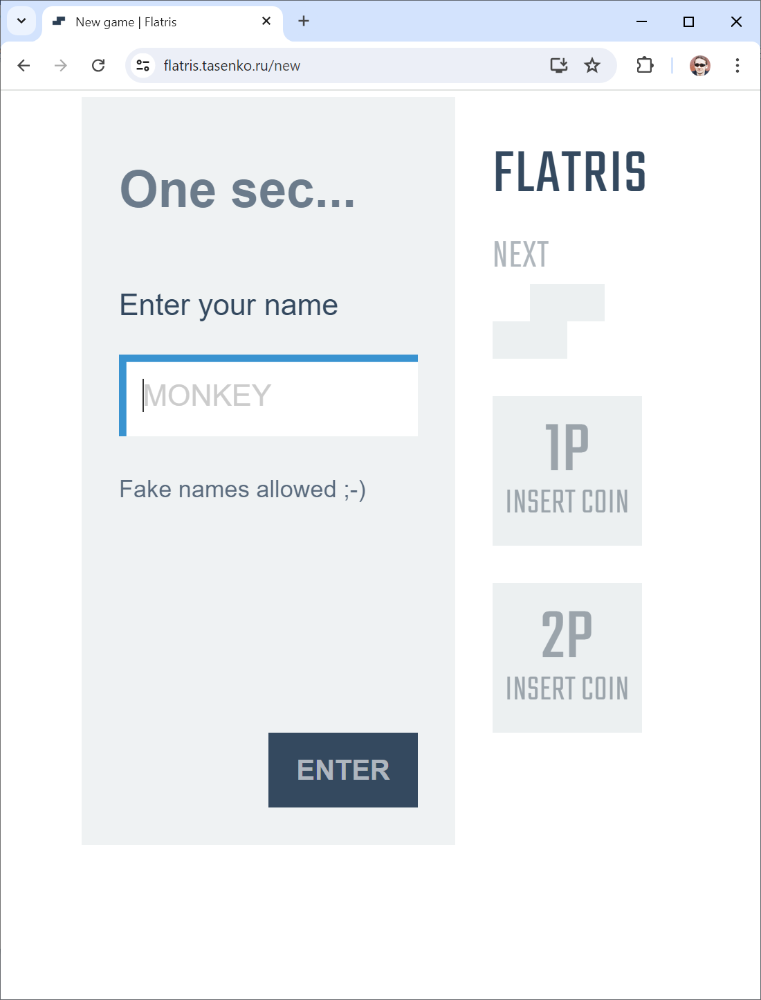

## Дипломный практикум в Yandex.Cloud  
### 1. Подготовить облачную инфраструктуру на базе облачного провайдера Яндекс.Облако.  
- Сервисный аккаунт создается в файле [sa-rbac-keys.tf](terraform/sa-rbac-keys.tf), там же ему назначаются рекомендованные роли и создается симметричный ключ для шифрования ресурсов.  
- Бэкенд для Terraform подготовил в Terraform Cloud. Описан в файле [provider.tf](terraform/provider.tf), там же указаны переменные с секретами для доступа к облаку. Сами секреты сохранены в безопасных переменных Terraform Cloud.  
- VPC с подсетями во всех зонах доступности создаются в [network.tf](terraform/network.tf), там же группы безопасности для кластера, шлюз и правило NAT для доступа группы узлов в Интернет.  
- В pull-request еще до слияния с веткой main по которой настроен запуск Run в Terraform Cloud сразу можно просмотреть plan и подправить ошибки.  

  

- Если все проверки прошли успешно, "мержим" в main.  

  

- Результат - запуск Run в Terraform Cloud и создание объектов в Yandex Cloud.  

  
  

### 2. Запустить и сконфигурировать Kubernetes кластер.  
Выбрал второй вариант: сервис Yandex Managed Service for Kubernetes и группа узлов.
- Региональный кластер создается в файле [cluster.tf](terraform/cluster.tf). Использует сервис-аккаунт созданный ранее.    
- После создания и инициализации файла конфига для подключения ```kubectl get pods -A``` отрабатывает без ошибок.  

  

### 3. Тут всё идёт не по плану. Запуск CD системы, основных контроллеров и мониторинга вместе с инициализацией кластера.  
В качестве CD системы было интересно попробовать FluxCD.  
Инициализация FluxCD происходит в следующих файлах:
- [provider.tf](terraform/provider.tf). Объявление необходимых провайдеров и их подключение к кластеру. Переменные "спрятаны" в Terraform Cloud.  
- [flux.tf](terraform/flux.tf). Создание deploy-key для работы с репозиторием и собственно инициализация репозитория.  
Тут я долгое время пытался сделать всё в одном репозитории, том же где находится этот README.md, уже добился запуска основных контроллеров (ingress-nginx, external-dns, cert-manager, sealed-secrets), но надолго застрял на интеграции мониторинга. Поэтому взял [форк манифестов и конфигов для мониторинга Flux от создателей](https://github.com/fluxcd/flux2-monitoring-example), инициализировал и продолжил работать в отдельном [репозитории](https://github.com/netology-diploma/diploma-test-app).  
Сразу после запуска (был установлен сам flux в одноименный namespace и инструменты мониторинга: kube-prometheus-stack, loki-stack, включена grafana (с паролем в открытом виде, да, его предстоит спрятать в сгенерированный секрет).  
Затем добавил cert-manager, external-dns, ingress-nginx и sealed-secrets для хранения API-токена панели управления Cloudflare где находится мой домен tasenko.ru. Всё это в папке [infrastructure](https://github.com/netology-diploma/diploma-test-app/tree/main/infrastructure/controllers), kustomization файл [здесь](https://github.com/netology-diploma/diploma-test-app/blob/main/clusters/test/controllers.yaml).  
К сожалению, не нашел простого и надежного способа спрятать секрет (API-токен Cloudflare) в переменных Terraform Cloud или GitHub и корректно передать его в манифест. Поэтому создание токена требует ручного запуска команд для специально подготовленного файла секрета:

```kubeseal -f .\_unencrypted_cloudflare-api-token.yaml -w cloudflare-api-token.yaml --controller-namespace sealed-secrets --controller-name sealed-secrets```
```k apply -f .\cloudflare-api-token.yaml```

- Следующим шагом применяю манифест [ClusterIssuer](https://github.com/netology-diploma/diploma-test-app/tree/main/infrastructure/issuers) и [кастомизацию](https://github.com/netology-diploma/diploma-test-app/blob/main/clusters/test/issuers.yaml), модифицирую файл релиза [kube-prometheus-stack](https://github.com/netology-diploma/diploma-test-app/blob/main/monitoring/controllers/kube-prometheus-stack/release.yaml) добавив туда блок Ingress для Grafana. Спустя некоторое время Grafana отвечает по адресу ~~https://grafana.tasenko.ru/~~ https://monitoring.tasenko.ru с доверенным сертификатом. Слишком часто генерировал сертификаты, уперся в лимит LE для домена.  

  
  

- Добавил еще щепотку зависимостей и теперь вся инфраструктура и готовый кластер стартуют по одному коммиту или ручному запуску ```terraform apply```. Развертывание external-dns стопорится из-за отсутствия секрета. После создания и применения секрета (и ручного удаления релиза для ускорения процесса) Flux применяет кастомизации заново и инфраструктура готова.  

### 4. Подготовка и деплой тестового приложения, сборка образа при помощи GitHub Actions.  
В качестве тестового приложения взял fork JavaScript приложения с которым я уже когда-то работал - [Flatris](https://github.com/atasenko/flatris).
- Собрал [Dockerfile](https://github.com/netology-diploma/diploma-test-app/blob/main/apps/flatris/Dockerfile), проверил запуском локально ~~завис минут на 10 в игре~~.  
- Перенес к себе в репозиторий в папку [apps/flatris](https://github.com/netology-diploma/diploma-test-app/tree/main/apps/flatris).  
- Создал Yandex Container Registry в файле [ycr.tf](terraform/ycr.tf), получил отдельный ключ для сервис-аккаунта командой ```yc iam key create --service-account-name cluster-sa-test -o key.json```, добавил его в качестве секрета YC_SA_JSON_CREDENTIALS в репозиторий GitHub.  
- Создал [workflow](https://github.com/netology-diploma/diploma-test-app/blob/main/.github/workflows/image-publish.yml) для сборки и публикации образов. После тестов оставил сборку только по пушу в main и semver тегам, добавил второй тег latest.  
Образ собирается, теги присваиваются:  

- 

### 5. Создание чарта, релиза, деплой.  
- Создал шаблон чарта запуском ```helm create flatris```, переписал под свои нужды файлы [Chart.yaml](https://github.com/netology-diploma/diploma-test-app/blob/main/charts/flatris/Chart.yaml) и [values.yaml](https://github.com/netology-diploma/diploma-test-app/blob/main/charts/flatris/values.yaml), положил в репозиторий.  
- Для публикации чарта в хранилище с помощью GitHub Actions написал файлы [chart-publish-ghcr.yml](https://github.com/netology-diploma/diploma-test-app/blob/main/.github/workflows/chart-publish-ghcr.yml) и [chart-publish-dockerhub.yml](https://github.com/netology-diploma/diploma-test-app/blob/main/.github/workflows/chart-publish-dockerhub.yml). Каждый публикует чарты по пушу в свою ветку. Зачем два? Об этом дальше.  
- Для проверки пишу файл values.yaml следующего содержания и выполняю на работающем кластере ручную установку:  

```
ingress:
  enabled: true
  annotations:
    kubernetes.io/ingress.class: nginx
    nginx.ingress.kubernetes.io/rewrite-target: /
    cert-manager.io/cluster-issuer: letsencrypt-prod
  hosts:
    - host: flatris.tasenko.ru
      paths:
        - path: /
          pathType: ImplementationSpecific
  tls:
    - secretName: letsencrypt-prod
      hosts:
        - flatris.tasenko.ru
```

```helm install flatris oci://registry-1.docker.io/fenixad/flatris -f values.yaml -n flatris```  

Получаю работоспособное приложение.  



- Осталось написать манифесты для автоматического деплоя средствами Flux и тут я надолго застрял.  
- Пишу [flatris-namespace.yaml](https://github.com/netology-diploma/diploma-test-app/blob/main/deploy-apps/flatris/flatris-namespace.yaml), [flatris-source.yaml](https://github.com/netology-diploma/diploma-test-app/blob/main/deploy-apps/flatris/flatris-source.yaml) и [flatris-release.yaml](https://github.com/netology-diploma/diploma-test-app/blob/main/deploy-apps/flatris/flatris-release.yaml)  
- [Кастомизацию](https://github.com/netology-diploma/diploma-test-app/blob/main/clusters/test/flatris.yaml) чтоб указать на всё это флаксу и...  Ничего не работает.  
- После обновления получаю вечно обновляющийся Kustomization, вечно в ошибке Helmrelease и отсутствие доступа к репозиторию чарта:  





Сначала я не использовал авторизацию в манифесте OCIRepository flatris-source.yaml, репозитории ведь доступны публично и работают при запуске ```helm install``` вручную. Пытался брать чарты из GitHub Registry, получал такую же ошибку что и сейчас с DockerHub. Создал секрет с именем пользователя и токеном в качестве пароля как описано в [документации](oci://registry-1.docker.io):  

```
flux create secret oci dockerhub-auth -n flatris --url=registry-1.docker.io --username=<username> --password=<token> --export > _unencrypted_docker-auth.yaml
```
Зашифровал sealed-secrets, добавил в кластер, но ситуация не изменилась.  

### Обновление от 22.06.2024  
Снова взялся за эту задачу. Подумал (и не ошибся) что мог напутать в секрете.  
Запустил инфраструктуру, обновил ID YCR, ключ сервис-аккаунта, секрет external-dns. Запушил новый docker image и чарт в ghcr.io.  
Сгенерировал новый GitHub access token с доступом к репозиторию и registry, вложил в секрет следующего вида:  
```
---
apiVersion: v1
kind: Secret
metadata:
  creationTimestamp: null
  name: ghcr-auth
  namespace: flatris
stringData:
  username: <username>
  password: <token>
```

Зашифровал через sealed-secrets и отправил в кластер.  
Насколько я понимаю, проблема авторизации решена, но чарт все равно не разворачивается, теперь с такой ошибкой:  



Пытаюсь открыть https://ghcr.io/v2/netology-diploma/flatris/manifests/latest с авторизацией в браузере или curl чтоб увидеть содержимое и продвинуться дальше.  

## Доработка замечаний  
### DRY Terraform  
1. "Упаковал" подсети в переменную типа map, группы безопасности в списки, роли в set и остальные параметры кластера в соответствующие типы.  
2. Все параметры кластера также вынес в переменные. Пока пытался определить блок location кластера ссылаясь на подсети созданные через for_each почувствовал себя героем этого мема  
  
Понял что блок необязательный, мастер сам возьмет доступные подсети из конфига сети.  

### Автоматизация при PR и Merge, тегирование и пайплайн сборки  
Вся автоматизация в GitHub Actions.  
- При пуше в любую ветку и наличии тега создается Docker image в YCR с тегами semver и latest.  
 Как должно было работать дальше:
- При пуше (и создании PR) в ветки helm-chart-update или helm-chart-update-docker происходит сборка нового чарта и отправка в соответствующий Helm repository c версией которую можно использовать в манифесте Flux HelmRelease или Kustomization. Далее merge в main, чтение Flux новой конфигурации и применение к кластеру.  
Такой подход должен давать возможность отдельного версионирования приложения (Docker image) и Helm чарта.  

Так как я не смог пока заставить работать Flux с самостоятельно созданным OCIRepository, появилась идея пропустить стадию создания и публикации чарта. Flux ведь может работать и просто с набором манифестов.  
- Создал файл [flatris-all-in-one.yaml](https://github.com/netology-diploma/diploma-test-app/blob/main/deploy-apps/flatris-manifests/flatris-all-in-one.yaml) с описанием приложения и напрвил на него [кастомизацию](https://github.com/netology-diploma/diploma-test-app/blob/main/clusters/test/flatris.yaml).  
- Поленился проверить всё ручным запуском, поэтому потратил гораздо больше времени и еще несколько коммитов на исправление нелепых ошибок конфигурации и вот оно, развернутое приложение:  

  

  

### Dockerfile и размеры итогового образа  
В первоначальном виде развернутое приложение занимало 1.65 ГБ (около 520 МБ в сжатом виде в реестре).    
Замена исходного образа на *-alpine позволила уменьшить объем вдвое.  
Сокращение количества слоев на итоговый размер не повлияло, пожалуй, только улучшило читаемость и чистоту кода без потери работоспособности.  

### Заменить ID YCR на DNS имя  
Хорошая идея, но у меня не вышло заставить это работать.  
Ничего не стоит добавить в Terraform провайдер Cloudflare и сразу при получении ID YCR создавать/обновлять CNAME в домене, но пушить по такому адресу не выходит. Сертификат конечного URL, естественно, не содержит моего домена.  
В принципе, неудобства возникают только при инфраструктуре-однодневке. В реальных условиях, мне кажется, адрес будет меняться не часто.  
Еще как вариант - использовать стороннее хранилище, например, DockerHub.  

### Список ручных операций при запуске:
- Получить ID YCR, вписать в [workflow публикации docker image](https://github.com/netology-diploma/diploma-test-app/blob/main/.github/workflows/image-publish.yml).
- Этот же ID переписать в файле [values.yaml](https://github.com/netology-diploma/diploma-test-app/blob/main/charts/flatris/values.yaml) чарта, значение image.repository. Сгенерировать новый чарт в репозитории пушем в ветку helm-chart-update.   
- Сгенерировать ключ для сервис-аккаунта, добавить/заменить секрет для доступа к YCR в GitHub.   
- Дождаться старта кластера, подключиться к нему, после старта sealed-secrets сгенерировать секрет API-токена Cloudflare, добавить в кластер.  
- Сгенерировать и добавить в кластер секрет для GitHub registry.
- Пуш с semver тегом в main для публикации docker image.  
- Пуш в ветку helm-chart-update или helm-chart-update-docker для публикации чарта с измененным адресом docker image.  
Всё остальное разворачивается автоматически по пушу в ветку terraform или кнопке New run в Terraform Cloud.
 