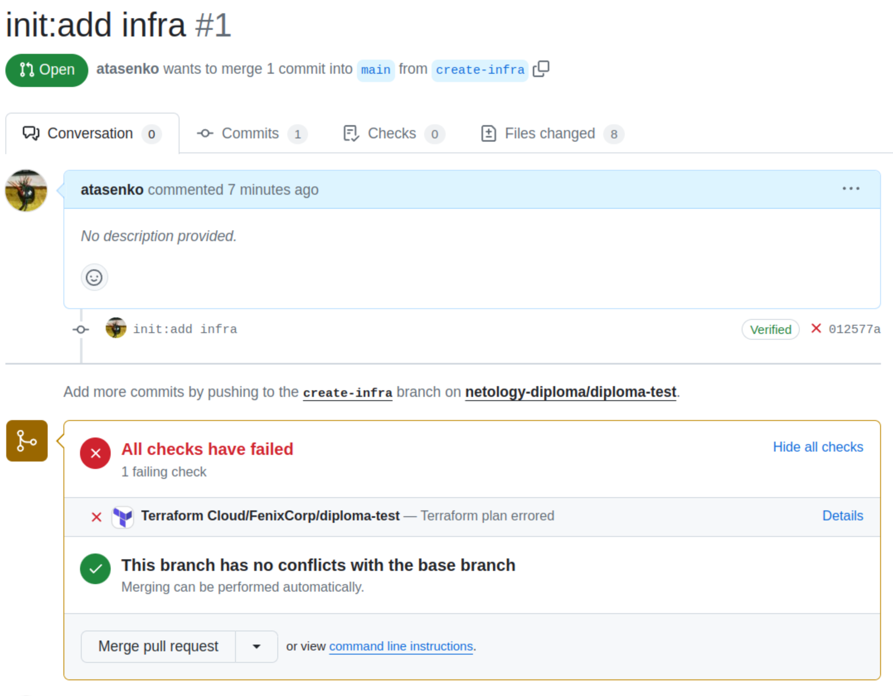
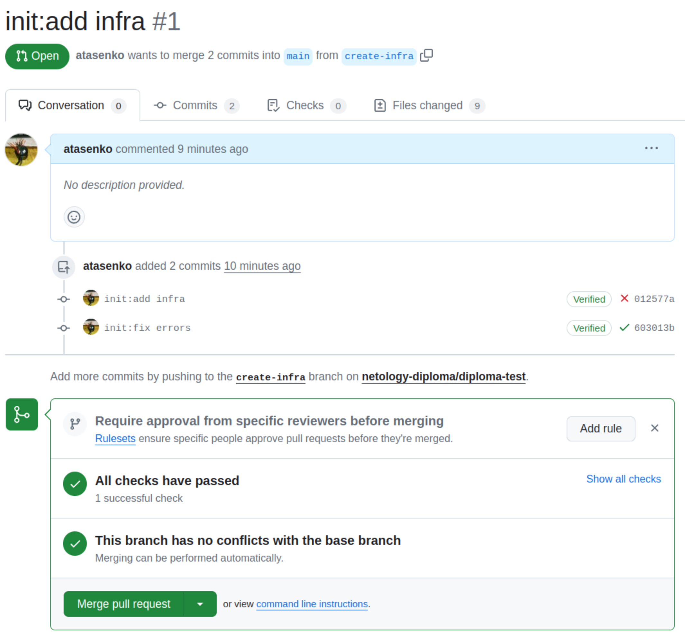
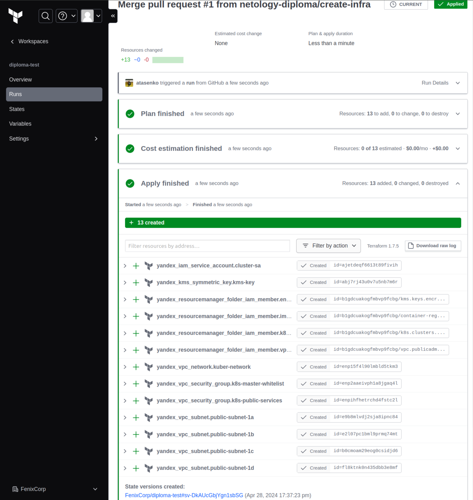
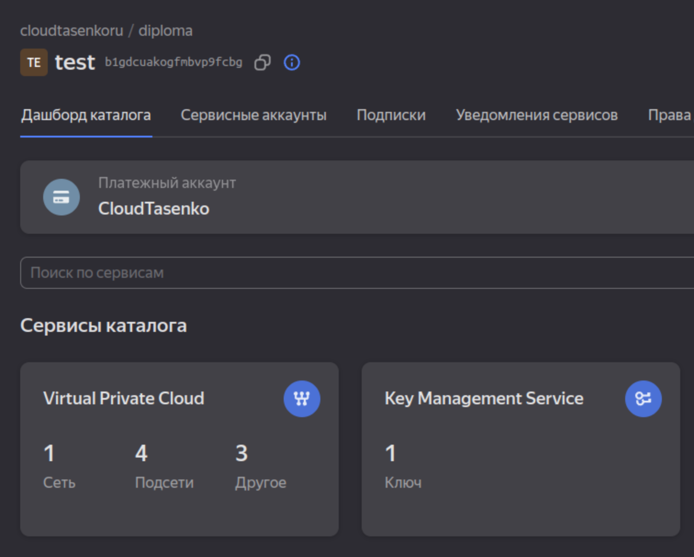

## Дипломный практикум в Yandex.Cloud  
### 1. Подготовить облачную инфраструктуру на базе облачного провайдера Яндекс.Облако.  
- Сервисный аккаунт создается в файле [sa-rbac-keys.tf](terraform/sa-rbac-keys.tf), там же ему назначаются рекомендованные роли и создается симметричный ключ для шифрования ресурсов.  
- Бэкенд для Terraform подготовил в Terraform Cloud. Описан в файле [provider.tf](terraform/provider.tf), там же указаны переменные с секретами для доступа к облаку. Сами секреты сохранены в безопасных переменных Terraform Cloud.  
- VPC с подсетями во всех зонах доступности создаются в [network.tf](terraform/network.tf), там же группы безопасности для кластера.  
- В pull-request еще до слияния с веткой main по которой настроен запуск Run в Terraform Cloud сразу можно просмотреть plan и подправить ошибки.  
  
- Если все проверки прошли успешно, "мержим" в main.  
  
- Результат - запуск Run в Terraform Cloud и создание объектов в Yandex Cloud.  
  
  
